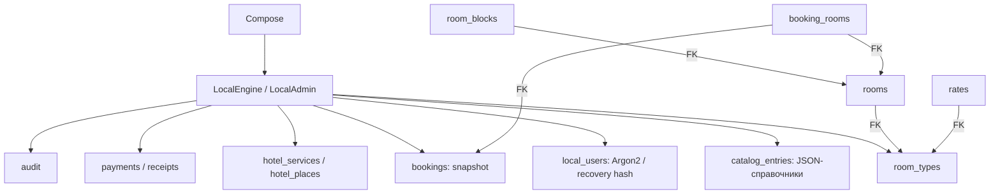
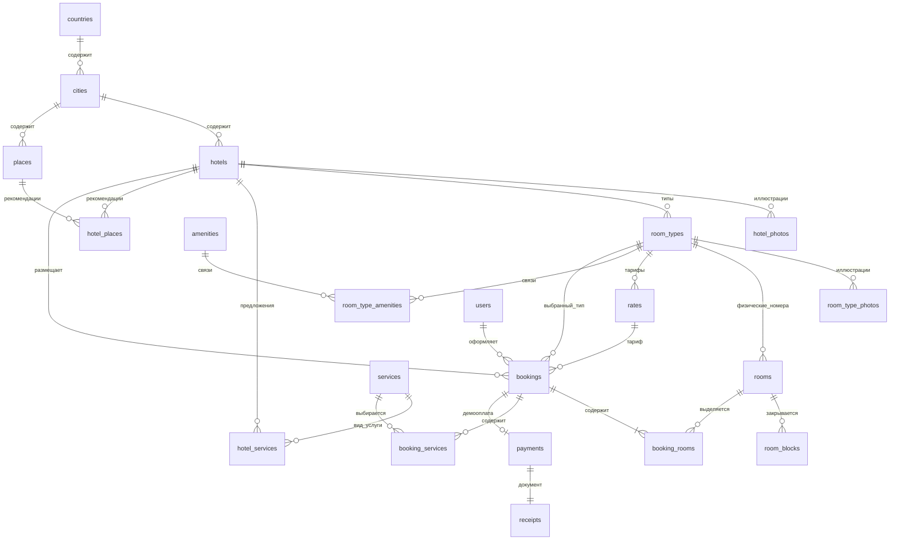

# SQL-модели: SQLite 0.9.0 и сохранённый PostgreSQL 0.6.0

## Рабочая база APK: Room/SQLite

Room schema v1 экспортирована в `android/app/schemas`. Money — INTEGER/Long в минимальных
единицах; UUID — TEXT. `catalog_entries` хранит отдельные JSON-записи стран, городов,
гостиниц, мест, удобств и metadata, не один монолитный каталог. Родительские связи
справочников валидирует LocalAdmin; они не объявлены SQL FOREIGN KEY.
Объекты типов/комнат/тарифов/услуг/блокировок/заказов/оплат имеют отдельные таблицы.
`bookings.payload` содержит неизменяемый snapshot цен, клиента, номера и услуг.
`hotel_places` — общие места города с M:N связями, не копии ресторана для каждого отеля.

Физические FK: rooms → room_types; rates → room_types; room_blocks → rooms;
booking_rooms → bookings/rooms, ON DELETE RESTRICT. Прочие связи логические и проверяются
в бизнес-транзакциях. Уникальные индексы защищают email, owner/idempotencyKey,
платёж для заказа, allocation booking/room и hotel/place. Повторное сохранение — @Upsert,
не INSERT OR REPLACE с удалением связанных строк.

Seed выполняется атомарно один раз. APK обновляется без destructive migration.
Истёкшие резервы игнорируются при подсчёте наличия; состояние обновляется при обращении
к базе. Устройство не использует серверное время. Логические и физические модели
не следует смешивать при защите курсовой работы.

## Архив SQL-модели этапов 3–6, версия 0.6.0

V1__foundation.sql (app_metadata) сохранена без изменения. V2__catalog_and_accounts.sql
добавляет новые таблицы, не пересоздаёт основную базу. PK UUID, FK, CHECK, UNIQUE и индексы.
UUID seed детерминирован; пользовательские UUID случайны. active=false исключает объект
из нового каталога, не удаляя запись. ON CONFLICT DO NOTHING не перезаписывает редактирование.

users связан с bookings через user_id.
email нормализованный/уникальный, password_hash PHC Argon2id, role USER/ADMIN,
active и created_at TIMESTAMPTZ. Пароль никогда не возвращается в API.

В countries/cities/hotels/places catalog_key UNIQUE хранит старый demo-id (legacyId JSON).
Hotel находится через city→country, комнаты через room_type→hotel; данные страны/гостиницы
не дублируются в rooms. Номер number уникален в типе; seed создаёт 101–104,201–204,301–304.
Для новых типов администраторский этап должен обеспечить уникальность физического номера
в пределах всей гостиницы отдельным правилом, не полагаться только на текущий UNIQUE.

rates: nightly_amount NUMERIC(12,2), currency, valid_from/valid_to DATE
(верхняя граница исключительная), режимы оплаты и срок отмены. V3 запрещает пересечение
активных диапазонов одного типа через EXCLUDE/btree_gist. SQL-поиск требует тарифа,
покрывающего весь период. Справочный каталог выбирает текущую цену и не гарантирует наличие.
hotel_services.amount NUMERIC(12,2), charge_unit PER_NIGHT_ROOM/ONCE.

Фотографии — ключи встроенных EXTERIOR/ROOM/POOL, не произвольные URL.
Places общие для города, связь hotel_places M:N. В seed все пять мест города связаны
с каждой его гостиницей. Сейчас карточка гостиницы честно показывает подборку города,
не вычисленное GPS-расстояние и не проверенные «ближайшие» реальные объекты.
Координаты/часы работы и кэш добавляются миграциями этапа 7.

Размер seed: 3 countries, 6 cities, 36 hotels, 108 room_types, 432 rooms,
108 rates, 7 amenities, 3 services, 108 hotel_services, 30 places, 180 hotel_places.
Редактирование prices/name после seed сохраняется. Если существующая запись неактивна,
повторный запуск не активирует её самовольно.

V3: room_blocks(id,room_id,start_date,end_date,reason,active), индекс дат;
cities.timezone IANA. Demo-блокировки идемпотентны, anchor хранится в app_metadata.

V4: bookings хранит владельца/гостиницу/тип/тариф, даты/гостей/room_count,
status/payment_method/payment_status, total_amount NUMERIC(12,2), currency,
expires_at/cancel_until/checkout_at/created_at TIMESTAMPTZ, причину отмены,
idempotency_key UUID и request_hash. UNIQUE(user_id,idempotency_key).
details_snapshot JSONB фиксирует клиента, адрес/названия, номера, ночную цену и услуги.
booking_rooms связывает один заказ с 1–4 физическими комнатами одного типа.
booking_services хранит FK услуги, сумму и JSONB-снимок, включая реквизиты трансфера.

V5: payments UNIQUE(booking_id), UNIQUE(user_id,idempotency_key), transaction_id UNIQUE,
сумма/валюта/paid_at/PAID либо REVERSED. receipts имеет UNIQUE(payment_id), UNIQUE(booking_id),
document_snapshot JSONB и created_at. Снимок не изменяется при аннулировании платежа.
Платёж, CONFIRMED/PAID и реквизиты документа фиксируются атомарно; PDF создаётся после COMMIT.

Заказы не удаляются каскадно. Доступность исключает CONFIRMED/COMPLETED и неистёкший
PENDING_PAYMENT с пересечением [check_in,check_out). Отменённый/истёкший резерв комнату
не занимает. Все операции записи соблюдают блокировку rooms UUID ASC перед bookings.
