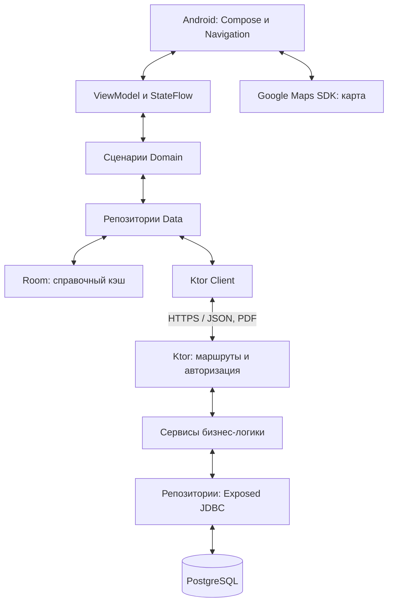
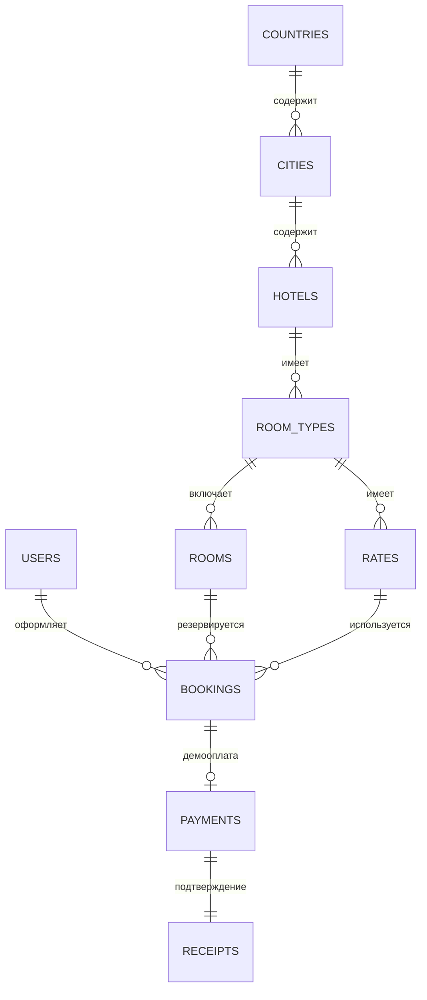
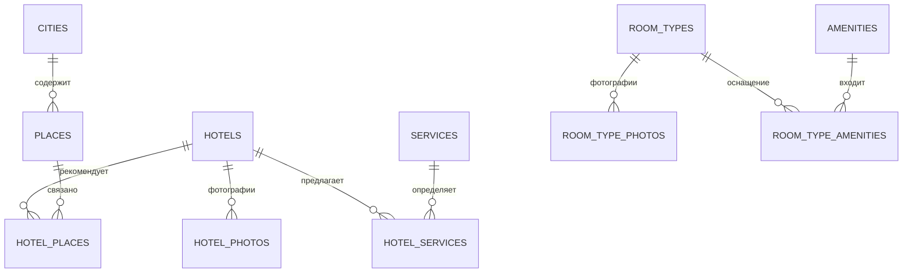

# 2. Разработка архитектуры системы

Историческая редакция на момент этапа 3 (0.3.0). Актуальная редакция 0.6.0:
Раздел_2_Архитектура_этапы_3_6.md и Архитектура_системы_этапы_3_6.pdf.

В данном разделе определяется архитектура мобильного приложения «Гостиница», состав компонентов, структура данных и правила их взаимодействия. Решения основаны на индивидуальном задании [1] и требованиях FR-01 - FR-11 и NFR-01 - NFR-07, сформулированных в разделе 1. Документ уточнен после практического этапа 3 (версия 0.3.0). Каталог SQL/API, учетные записи и профиль реализованы; бронирование, демооплата, PDF-подтверждения, карта, Room и полный административный CRUD остаются проектными решениями следующих этапов. Фактический состав текущей версии отдельно приведен в подразделе 2.7; описание будущей функции не означает ее готовность.

## 2.1 Выбор архитектурного подхода

Выбирается трехуровневая клиент-серверная архитектура: Android-приложение на Kotlin, серверное приложение Ktor с REST API и реляционная база PostgreSQL. Мобильный клиент отвечает за интерфейс и взаимодействие с пользователем; сервер - за права доступа, бизнес-правила и согласованность операций; PostgreSQL - за долговременное хранение данных и транзакции.

Локальная система без сервера не обеспечивает общий каталог и надежное бронирование при работе нескольких клиентов. Прямой доступ Android-приложения к PostgreSQL потребовал бы распространения учетных данных базы и затруднил централизованную проверку правил. Поэтому клиент обращается только к API, а база недоступна непосредственно мобильным устройствам.

Сервер реализуется как модульный монолит, а не набор микросервисов. Для курсового проекта это уменьшает сложность запуска, тестирования и управления транзакциями. Каталог, учетные записи, бронирования, демонстрационные платежи и документы разделяются по пакетам, но работают в одном серверном процессе. Применение Kotlin на обеих сторонах сокращает число используемых языков, не отменяя независимости клиента и сервера.

Данные передаются в JSON по HTTPS. Бинарный PDF передается отдельным ответом. PostgreSQL является авторитетным источником данных, особенно для цены и доступности. На этапе 7 Room будет хранить только локальные копии справочных сведений; в версии 0.3.0 постоянного кэша нет. Google Maps SDK используется для карты; сведения о гостиницах и местах поступают из собственного API, а не автоматически из картографического сервиса.

Рисунок 2.1 - Компоненты системы и каналы взаимодействия

[[figure:component]]



Стрелки на рисунке обозначают взаимодействие при выполнении запроса и передаче результата, а не направление зависимостей исходного кода. Карта является отдельным внешним компонентом; она не участвует в транзакции бронирования и не должна быть обязательным условием доступа к списку номеров.

## 2.2 Архитектура Android-приложения

В клиенте используются Jetpack Compose, MVVM и разделение UI - Domain - Data. Официальное руководство Android выделяет UI и Data как основные слои и допускает Domain при наличии сложной или повторно используемой логики [2]. В данном проекте Domain применяется для сценариев поиска, оформления и отмены заказа. Подход Clean Architecture используется в ограниченном объеме, без создания отдельного модуля для каждого экрана.

Таблица 2.1 - Слои мобильного клиента

| Слой | Ответственность и средства |
|---|---|
| UI | Экраны Compose, Navigation Compose, ViewModel, StateFlow. Представление состояния и обработка событий; отсутствие SQL и HTTP-запросов непосредственно в composable-функциях. |
| Domain | Модели предметной области, интерфейсы репозиториев и сценарии SearchHotels, CreateBooking, CancelBooking, PayDemo, GetReceipt. Предварительная проверка ввода, но не окончательное решение о цене и занятости. |
| Data | Реализации репозиториев, Ktor Client, DTO, преобразование моделей, Room DAO и сущности кэша. Выбор источника данных и обработка ошибок сети. |

UI зависит от интерфейсов сценариев Domain, Data реализует интерфейсы репозиториев, а Domain не импортирует Compose, Room и сетевой клиент. Hilt связывает реализации зависимостей [3]. Для серверного приложения Android-библиотека Hilt не используется: зависимости передаются через конструкторы и конфигурацию приложения.

ViewModel предоставляет неизменяемое состояние экрана: загрузка, содержимое, пустой результат либо ошибка. События пользователя передаются в ViewModel, асинхронные операции выполняются с Coroutines, результат поступает через StateFlow и наблюдается с учетом жизненного цикла. Состояние формы и выбранные фильтры восстанавливаются после поворота; существенные идентификаторы и параметры сохраняются через SavedStateHandle. ViewModel сама по себе не гарантирует восстановление после завершения процесса.

Навигация включает выбор направления и дат, результаты поиска, карточки гостиницы и номера, ближайшие места, вход/регистрацию, оформление, личный кабинет, историю, документ и административные экраны. Между экранами передаются идентификаторы и минимальные параметры, а не большие объекты каталога. Административные разделы показываются только соответствующему пользователю, но окончательные проверки остаются на сервере.

Для HTTP выбран Ktor Client; параллельное применение Retrofit не планируется. Репозитории различают ошибки сети, истечение авторизации, недопустимый ввод и конфликт доступности. Пока запрос выполняется, повторное подтверждение в интерфейсе блокируется; это улучшает поведение UI, но не заменяет серверную идемпотентность.

На этапе 7 Room будет кэшировать страны, города, описания гостиниц и ближайшие места. Применяется network-first: при доступной сети репозиторий получает свежие данные, обновляет соответствующую выборку в одной локальной транзакции и возвращает результат; при сетевом сбое показывает имеющийся кэш и время обновления. Для частичных списков сохраняются ключ запроса и принадлежность элементов выборке, чтобы не смешивать результаты разных городов или фильтров. В отличие от полноценного offline-first-подхода [4], очереди отложенных записей здесь нет.

Наличие сети само по себе не считается успешной загрузкой. При отсутствии ответа API используются только справочные описания. Номера с актуальными ценами и доступностью, личные заказы, платежи, отмена и административные изменения не выполняются из кэша. Надпись «данные сохранены ранее» предотвращает восприятие старого каталога как гарантии свободного номера.

На этапе 7 карта будет реализована через Google Maps Compose [5]. Она получает координаты из API и показывает маркеры гостиниц и ближайших мест. Выбор карточки выделяет маркер, выбор маркера открывает сведения. Для SDK требуется настройка проекта, API-ключа и биллинга согласно документации [6]; ключ ограничивается приложением и сертификатом. Разрешение геолокации не требуется, пока не добавлено определение текущего положения. При недоступности карты текстовый список сохраняет работоспособность. Places API и автоматический импорт рейтингов не предусмотрены.

## 2.3 Архитектура серверной части

### 2.3.1 Компоненты, права доступа и API

Ktor разделяется на routes, services и repositories. Маршруты разбирают запрос, вызывают аутентификацию и возвращают стандартизированный ответ. Сервисы проверяют правила, управляют состояниями и границами транзакций. Репозитории выполняют SQL через Exposed JDBC. Блокирующие JDBC-операции выполняются на выделенном ограниченном IO-диспетчере с пулом соединений, а не в потоке обработки событий. Документация Exposed отдельно отмечает блокирующее поведение JDBC-транзакций [7].

Сервер валидирует даты, вместимость, принадлежность услуг гостинице, соответствие тарифа типу номера, валюту, активность объектов и допустимые переходы состояний. Клиентская сумма не принимается как достоверная. Работа с JSON выполняется через DTO; сущности SQL и хеши паролей не возвращаются клиенту.

Для аутентификации используется JWT в REST-сервере Ktor [8]; в текущем коде проверка выполняется TokenService/AuthService до защищенного обработчика, без отдельной установки Ktor Authentication plugin. Гость не имеет токена; в базе хранятся роли USER и ADMIN. При регистрации создается только USER. Пароль хранится как Argon2id: 19 MiB, две итерации, параллелизм 1, случайная соль 16 байт и хеш 32 байта [13]. Реализация Bouncy Castle 1.86 выполняется на JVM без native-зависимости. JWT действует 30 минут; токен шифруется Android Keystore AES-GCM в noBackupFilesDir. Токен ограничивается по времени, проверяются подпись, срок, издатель и аудитория; сервер дополнительно проверяет активность пользователя и текущую роль в базе. Секрет подписи хранится вне репозитория. В первой версии при истечении токена выполняется повторный вход, без отдельной схемы refresh-токенов.

Android хранит токен в защищенном локальном хранилище с ключом Android Keystore, очищает его при выходе и не включает в журналы. Каждый запрос к заказу или документу проверяет владельца. Для администратора предусмотрен отдельный контролируемый способ создания учетной записи при развертывании; пользователь не может назначить себе роль через API.

API имеет общий префикс /api/v1. В таблице 2.2 пути приводятся относительно него. GET не изменяет состояние системы. Создание и изменение требуют подключения и проверки прав.

Таблица 2.2 - Основные группы REST API

| Группа и методы | Назначение и доступ |
|---|---|
| /auth: POST /register, /login | Создание USER и получение токена. Доступны неавторизованному клиенту; ошибки входа не раскрывают наличие чужой учетной записи. |
| /locations: GET /countries, /cities | Географические справочники; фильтрация городов по countryId. Публичное чтение. |
| /hotels: GET список, /{id}, /{id}/places | Публичный каталог с пагинацией; сведения и связанные городские места. В 0.3.0 подбор по датам еще не выполняется. |
| /places: GET список | Общий справочник города с cityId, связанный с гостиницами через hotel_places; только информация, без билетов и брони. |
| /rooms: GET список по hotelId | Физические номера, типы и тарифы. В 0.3.0 availabilityGuaranteed=false; поиск доступности по датам относится к этапу 4. |
| /bookings: POST; GET список и /{id}; POST /{id}/cancel | Создание, собственная история, подробности и отмена. USER/ADMIN в пределах своих заказов; административные операции отделены. |
| /payments/demo: POST | Подтверждение демооплаты собственного заказа по bookingId и ключу идемпотентности. Не принимает реквизиты карты. |
| /receipts: GET /{id} | PDF-подтверждение демооплаты. Только владелец заказа либо администратор. |
| /profile: GET, PATCH | Чтение и редактирование собственного профиля. Изменение роли и идентификатора запрещено. |
| /admin: GET /summary; будущие POST/PATCH | Сейчас только SQL-сводка для ADMIN. Полное управление каталогом, тарифами, блокировками и заказами - этап 8. |

Запрос создания заказа содержит roomId, rateId, даты, взрослых/детей, выбранные услуги и количества, paymentMethod и ключ идемпотентности. Ответ содержит номер, сумму, валюту, статус и, при необходимости, expiresAt. Для списков задается максимальный размер страницы. Запросы с одинаковыми датами и фильтрами имеют однозначный смысл; цена за ночь не смешивается с общей стоимостью поездки.

Общие ответы об ошибках содержат code, message, fieldErrors и requestId без внутренних SQL-запросов. Применяются HTTP 400 для некорректного ввода, 401 для отсутствующей/недействительной авторизации, 403 для запрещенного действия, 404 для недоступного объекта и 409 для конфликта занятости, состояния или повторного ключа с другим содержимым. Ошибка сервера возвращается без секретов и технической трассировки.

### 2.3.2 Согласованность бронирования

Проверка свободного номера до транзакции недостаточна: два клиента могут одновременно увидеть один вариант. Сервер начинает транзакцию PostgreSQL с уровнем READ COMMITTED, блокирует строку конкретного номера через SELECT FOR UPDATE и только затем отдельным запросом повторно проверяет пересечения. Такая блокировка сериализует конкурирующие операции над одной строкой [9]. Все операции, меняющие доступность, используют тот же порядок: номер, затем заказ и связанные записи.

После получения блокировок фиксируется текущий момент серверных часов; просроченные резервы не считаются действующими. Проверяются подтвержденные бронирования, PENDING_PAYMENT с expiresAt позднее этого момента и административные блокировки. Интервалы пересекаются, если начало первого раньше конца второго и конец первого позднее начала второго. При конфликте транзакция откатывается и возвращается 409. При успехе в той же транзакции сохраняются заказ, услуги и снимок условий.

Подтвержденные и завершенные исторические заказы сохраняют запись о занятых датах. Новые заезды в прошлом запрещены. При административном закрытии номера проверяются имеющиеся заказы, а уже занятый период не блокируется без отдельного разрешенного решения. Изменение активности гостиницы/типа влияет на новую продажу, но не отменяет существующие заказы. При создании проверяются и блокируются необходимые тарифные и каталожные записи; административные операции следуют совместимому фиксированному порядку блокировок.

Уникальность пары (user_id, idempotency_key) защищает создание заказа от дублей. Сервер хранит также отпечаток параметров. Повтор с тем же ключом и содержимым возвращает существующий результат; с другим содержимым - 409. При одновременных вставках конфликт уникальности обрабатывается чтением сохраненного результата после отката. Повтор запроса не продлевает резерв и не создает новый заказ вместо отмененного.

Для ONLINE_DEMO устанавливается PENDING_PAYMENT и резерв на 15 минут. Оплата, отмена и создание блокировки повторно проверяют актуальный срок под блокировкой. Фоновая процедура переводит истекшие резервы в CANCELLED с причиной EXPIRED. Корректность доступности не зависит от времени ее запуска: истекшие записи исключаются по expiresAt, а при чтении показываются как недействующие. Обычный GET не производит скрытую запись.

При PAY_AT_HOTEL заказ сразу становится CONFIRMED, а payment_status остается UNPAID. Внесение оплаты в гостинице отражается администратором как PAID без создания демонстрационной онлайн-транзакции. В обеих ветвях способ оплаты фиксируется при оформлении и не изменяется произвольно.

### 2.3.3 Состояния, демонстрационная оплата и документы

Статусы заказа: PENDING_PAYMENT, CONFIRMED, CANCELLED, COMPLETED. Отдельное поле оплаты принимает UNPAID, PAID или REVERSED. Методы оплаты: ONLINE_DEMO и PAY_AT_HOTEL. Для гостя отсутствует сохраненная роль GUEST: это обозначение режима клиента. Перечисления проверяются сервером и ограничениями базы.

Допустимы переходы PENDING_PAYMENT → CONFIRMED при успешном демоплатеже, PENDING_PAYMENT → CANCELLED при отмене или истечении срока, CONFIRMED → CANCELLED по сохраненной политике и CONFIRMED → COMPLETED после выезда. Возврат из CANCELLED или COMPLETED в активное состояние запрещен. При отмене оплаченного демозаказа статус оплаты становится REVERSED; это учебное аннулирование, а не банковский возврат. Администратор не обходит бизнес-правила произвольным редактированием статуса.

Демооперация выполняется только для собственного неистекшего ONLINE_DEMO-заказа. Сервер проверяет сумму по заказу, создает платеж с уникальным идентификатором, подтверждает бронирование и сохраняет реквизиты документа атомарно в одной транзакции. Уникальный payment.booking_id исключает несколько успешных демоплатежей по одному заказу. Повтор с тем же ключом возвращает прежний результат; другой ключ для уже оплаченного заказа не создает новую операцию. Отказ или сетевой сбой не обозначается как успешная оплата.

После фиксации транзакции PDF формируется компонентом ReceiptService по неизменяемым снимкам реквизитов, а не по текущим названиям и ценам каталога. Генерация файла не удерживает блокировки SQL. Сбой генерации не отменяет уже подтвержденный платеж: повтор GET /receipts/{id} формирует тот же документ по сохраненным данным. Файл передается как application/pdf и доступен только уполномоченному пользователю.

PDF содержит номер заказа, имя клиента, гостиницу, номер, даты, сумму и валюту, дату и метод оплаты, идентификатор операции, ее исходное состояние и предупреждение о демонстрационном характере. При отмене исходное подтверждение сохраняется как исторический документ, а текущее аннулирование видно в заказе и платежной информации. Документ не называется фискальным чеком. Клиент сохраняет его через системный выбор файла и передает в Android Print Framework; отдельный сервис печати на сервере не требуется.

## 2.4 Архитектура базы данных

Выбирается PostgreSQL как централизованная реляционная СУБД с внешними ключами, ограничениями и транзакциями. Exposed применяется для доступа к SQL, но не подменяет проектирование схемы. Изменения структуры оформляются версионируемыми SQL-миграциями, например средствами Flyway. Автоматическое разрушительное пересоздание таблиц при запуске не допускается.

Типовая запись имеет первичный ключ id типа UUID. Ссылки используют UUID, даты проживания - DATE, моменты операций - TIMESTAMPTZ, денежные суммы - NUMERIC(12,2), валюты - трехбуквенный код. Большие изображения хранятся файлами, в базе - их адреса и порядок отображения. Справочные данные нормализуются; снимок реквизитов заказа является намеренной денормализацией для сохранения истории.

Таблица 2.3 - Основные таблицы каталога

| Таблица | Существенные поля и связи |
|---|---|
| countries, cities | id UUID, catalog_key UNIQUE, name, active. В countries currency; в cities country_id и caption. Координаты - расширение этапа 7. |
| hotels | id, catalog_key, city_id, name, stars, rating, distance_km, address, description, active. Координаты/часовой пояс добавляются при реализации карты и правил проживания. |
| hotel_photos | id, hotel_id, photo_key, position, active. В 0.3.0 ключи встроенных учебных иллюстраций, не фотографии реального объекта. |
| room_types, room_type_photos | Тип: id, hotel_id, kind, capacity, area, active. Фото: id, room_type_id, photo_key, position, active. |
| rooms | id, room_type_id, number, active; гостиница через тип. SQL UNIQUE(room_type_id, number). Проверка уникальности номера во всей гостинице проектируется для административного этапа 8. |
| amenities, room_type_amenities | Справочник удобств и связующая таблица с составным первичным ключом (room_type_id, amenity_id). |
| rates | id, room_type_id, valid_from, valid_to, nightly_amount, currency, allow_demo, allow_at_hotel, free_cancel_hours, active. Сейчас выбирается активный тариф текущей даты; покрытие всей поездки проверит этап 4. |
| services, hotel_services | Справочник id, code, name, description, active. Связь: hotel_id, service_id, amount, charge_unit, active; составной PK. Валюта выводится из страны гостиницы. |
| places, hotel_places | places: id, catalog_key, city_id, category, name, description, address, photo_key, active. hotel_places: составной PK (hotel_id, place_id). Один городской объект связан с несколькими гостиницами без дублирования. Координаты/часы работы - этап 7. |
| room_blocks | id, room_id, start_date, end_date, reason, active. Исключает продажу номера на административно закрытый интервал. |

Таблица 2.4 - Учет пользователей и операций

| Таблица | Существенные поля и связи |
|---|---|
| users | id, email, password_hash, full_name, phone, role, active. Нормализованный email уникален. |
| bookings | id, user_id, room_id, rate_id, check_in, check_out, adults, children, status, payment_method, payment_status, total_amount, currency, expires_at, cancel_until, cancellation_reason, created_at, idempotency_key, request_hash, details_snapshot. |
| booking_services | booking_id, hotel_service_id, quantity, unit_amount_snapshot, charge_unit_snapshot, currency, name_snapshot. Составной ключ предотвращает повтор одной услуги. |
| payments | id, booking_id, transaction_id, idempotency_key, request_hash, amount, currency, status, paid_at, reversed_at. Только демооперации; booking_id и transaction_id уникальны. |
| receipts | id, payment_id, receipt_number, issued_at, document_snapshot. payment_id и receipt_number уникальны. Один платеж имеет одно подтверждение. |

details_snapshot фиксирует клиента, названия и адрес гостиницы, обозначение и тип номера, ночную цену, услуги и условия отмены. document_snapshot хранит сведения, необходимые для воспроизведения PDF. Снимки заполняются сервером и не доступны для произвольной правки. Они не заменяют внешние ключи и числовые поля, используемые в поиске и отчетах.

Схема разделена на два рисунка для читаемости. Таблицы room_blocks, bookings, booking_services, payments и receipts на данном этапе только проектируются и пока отсутствуют в SQL. Рисунок 2.2 показывает целевую модель с будущими операциями; рисунок 2.3 - реализованные связи дополнительного каталога. На рисунке 2.2 представлены география, номерной фонд и операции; на рисунке 2.3 - остальные связи каталога. Повторенные узлы обозначают те же таблицы, а не дубликаты. Кардинальность 1:N означает одного родителя и от нуля до множества дочерних записей; 1:0..1 - не более одной необязательной записи, 1:1 - ровно одну связанную запись.

Рисунок 2.2 - ER-модель: размещение, пользователи и заказы

[[figure:er_core]]



Рисунок 2.3 - ER-модель реализованного каталога: общие места, оснащение и услуги

[[figure:er_extra]]



Первичные и внешние ключи обеспечивают целостность; CHECK ограничивает положительную цену, количество гостей, порядок дат и значения перечислений. Физическое удаление справочника, связанного с историей, запрещается; используется active. Для тарифа проверяются valid_from < valid_to, покрытие всего проживания и наличие хотя бы одного разрешенного способа оплаты. Для услуг проверяются гостиница и валюта. Составные правила, затрагивающие разные таблицы, проверяются сервисом в транзакции, а не ошибочно объявляются обычными CHECK-ограничениями.

Номера одного типа относятся только к гостинице этого типа. Сервер не допускает тариф другого типа или услугу другой гостиницы. Для уникальности обозначения номера внутри гостиницы создание/переименование номеров сериализуется блокировкой гостиницы и проверкой через связь rooms → room_types. В дальнейшем это правило можно вынести в составное SQL-ограничение при изменении схемы; в выбранной модели оно явно является транзакционным бизнес-правилом.

Индексы предусматриваются на city_id гостиницы, hotel_id типа, room_type_id номера и тарифа, user_id/created_at заказа и room_id/check_in/check_out. Для истекающих резервов нужен индекс по status/expires_at, для блокировок - по room_id и датам. Поле «свободен» не хранится как независимый постоянный флаг: доступность вычисляется на интервал, иначе оно могло бы противоречить истории заказов.

Room не является репликой всей PostgreSQL-базы. В него не копируются пароли, административные данные, платежные записи или актуальная занятость. Различие моделей DTO, Domain и локальной сущности позволяет менять транспортный формат без прямой зависимости интерфейса от SQL-схемы.

## 2.5 Взаимодействие компонентов

### 2.5.1 Каталог, поиск и административные изменения

При открытии каталога UI передает событие ViewModel, сценарий вызывает репозиторий, а Ktor Client запрашивает API. Сервер читает справочники и возвращает DTO; Data преобразует их, обновляет допустимый кэш и передает состояние экрану. При поиске сервер применяет даты, вместимость и фильтры, исключает блокировки и действующие заказы и возвращает страницу вариантов. Карта и список используют одни идентификаторы объектов.

Администратор отправляет изменение через /admin. Сервер проверяет ADMIN, валидирует поля, сохраняет результат транзакционно и возвращает актуальную версию. После успешной операции соответствующие экран и выборка обновляются; другие клиенты получают изменения при следующей загрузке. Постоянные WebSocket-уведомления не требуются. Журнал административных действий содержит идентификатор исполнителя, объект, действие и время без паролей и токенов.

### 2.5.2 Создание заказа

Пользователь предварительно проходит вход, выбирает номер и условия, затем подтверждает заказ. На рисунке 2.4 показано взаимодействие Android, API и PostgreSQL. Проверка JWT и владельца выполняется до защищенной операции; все ответы возвращаются Android-клиенту, а не непосредственно пользователю.

При оплате в гостинице оформление завершается подтверждением неоплаченного заказа. Для ONLINE_DEMO интерфейс показывает оставшееся время и действие оплаты. Эти варианты являются альтернативами, а не последовательными обязательными действиями.

Рисунок 2.4 - Последовательность создания бронирования

[[figure:booking]]

```mermaid
sequenceDiagram
    participant A as Android
    participant K as Ktor API
    participant D as PostgreSQL
    A->>K: POST /bookings, JWT, ключ
    K->>K: Авторизация и проверка ввода
    K->>D: BEGIN; блокировка номера
    K->>D: Проверка интервала, тарифа, услуг
    alt Конфликт или ошибка
        K->>D: ROLLBACK
        K-->>A: 409 либо ошибка ввода
    else Доступно
        K->>D: Заказ, услуги, снимок; COMMIT
        K-->>A: ID, сумма, статус, expiresAt
    end
    Note over A,K: ONLINE_DEMO: ожидание; PAY_AT_HOTEL: подтверждено
```

### 2.5.3 Демонстрационная оплата и PDF

Рисунок 2.5 - Последовательность демооплаты и получения документа

[[figure:payment]]

```mermaid
sequenceDiagram
    participant A as Android
    participant K as Ktor API
    participant D as PostgreSQL
    A->>K: POST /payments/demo, JWT, ключ
    K->>D: BEGIN; блокировка номера и заказа
    K->>K: Владелец, метод, состояние, срок
    alt Заказ действителен
        K->>D: Платеж, CONFIRMED, реквизиты PDF; COMMIT
        K-->>A: Статус PAID, receiptId
        A->>K: GET /receipts/{id}, JWT
        K->>D: Чтение снимка и проверка владельца
        K->>K: Формирование PDF после транзакции
        K-->>A: application/pdf
    else Истекший либо запрещенный заказ
        K->>D: ROLLBACK
        K-->>A: 403/409, без успешной оплаты
    end
```

Отмена, демооплата и новое бронирование одного номера согласуются через единый механизм блокировок. Если платеж и истечение резерва происходят одновременно, результат определяется состоянием и серверным временем после получения блокировок. Клиент не подтверждает оплату только по своему таймеру и не создает PDF до получения успешного ответа сервера.

## 2.6 Обеспечение требований задания

### 2.6.1 Прослеживаемость требований

Таблица 2.5 связывает обязательные требования задания и расширения с проектными компонентами. Наличие компонента в архитектуре означает план обеспечения требования, но не доказательство успешной реализации.

Таблица 2.5 - Требования, компоненты и проверка

| Требование | Компонент и способ подтверждения |
|---|---|
| FR-01: каталог номеров | CatalogService, hotels/room_types/rooms, экраны карточек. Проверка полноты структурированных полей и принадлежности номера. |
| FR-02: фильтрация | SearchHotels, серверный запрос с датами и параметрами. Тесты сочетаний фильтров, сортировки и пустого результата. |
| FR-03: дополнительные услуги | hotel_services, booking_services, форма заказа. Тесты цены, единицы начисления и запрета чужой услуги. |
| FR-04: личный кабинет | /auth, /profile, users. Тесты входа, изменения профиля и отказа в доступе к чужим данным. |
| FR-05: бронирование | BookingService, транзакция и блокировка номера. Конкурентный тест: из двух пересекающихся заказов подтверждается только допустимый. |
| FR-06: история и отмена | /bookings, статусы и снимок политики. Проверка истории, граничного времени отмены и сохранения цены. |
| FR-07: SQL и кабинет администратора | PostgreSQL, /admin, административные Compose-экраны. CRUD-проверки и запрет USER на административные операции. |
| FR-08 - FR-11: расширения | Карта/места, демооплата, ReceiptService и Room. Проверки отсутствия бронирования мест, срока резерва, PDF и режима без сети. |
| NFR-01: Android, Kotlin | Android Studio, Compose-клиент и сборка APK. Фиксация конфигурации сборки. |
| NFR-02: SQL | Миграции PostgreSQL, Exposed и ограничения. Интеграционные тесты схемы и транзакций на PostgreSQL. |
| NFR-03: Dokka | KDoc публичных моделей, репозиториев и сценариев; генерация документации Gradle-задачей Dokka [10]. |
| NFR-04: GitHub | Репозиторий android/server/docs, README, миграции и тесты; исключение секретов и сгенерированных локальных данных. |
| NFR-05: модульные тесты | kotlin.test/JUnit, подменные репозитории и тестовый диспетчер Coroutines. Проверка правил и ViewModel. |
| NFR-06: три виртуальных устройства | AVD с разными размерами и API. Протоколы выполнения одного функционального набора на каждом устройстве. |
| NFR-07: UI-автоматизация | Compose UI Test, семантические метки и androidTest [11]. Проверка действий и состояния экранов. |
| Структуры данных и будущие материалы | Таблицы и ER-модель приведены в этом разделе. Комментированный код, реальные скриншоты, руководства, двуязычная аннотация и остальные части записки готовятся после реализации согласно заданию. |

### 2.6.2 План проверки и воспроизводимости

Модульные тесты проверяют допустимость дат и числа гостей, расчет числа ночей и стоимости услуг, правила переходов состояний и обработку ошибок во ViewModel. Сетевые зависимости подменяются, время задается управляемыми часами. Тесты не должны зависеть от текущей даты, реальной карты или коммерческого платежного сервиса.

Backend API проверяется средствами Ktor testApplication [12]. SQL-интеграционные тесты выполняются на тестовой PostgreSQL, поскольку упрощенная база не воспроизводит все особенности ее блокировок. Обязательны конкурентные запросы одного номера, смежные интервалы без пересечения, истекший резерв, повторный ключ, демооплата одновременно с отменой, ошибка генерации PDF и откат при недопустимых данных.

Предварительная матрица функционального тестирования: компактный телефон Android 11/API 30, 360 × 640 dp; обычный телефон Android 15/API 35, 411 × 891 dp; планшет Android 16/API 36, 800 × 1280 dp. Это проектные конфигурации, а не протокол уже проведенных испытаний. Минимальный API 26 принимается как исходное решение и уточняется при проверке совместимости выбранных библиотек. При необходимости матрица обновляется, сохраняя не менее трех различных AVD.

На каждом устройстве проверяются поиск, фильтры, каталог, услуги, вход, оформление обоими способами, история, отмена, документ и административное редактирование. Отдельно выполняются поворот экрана, увеличенный размер системного шрифта и отключение сети. Автоматизированные Compose-тесты проверяют ввод, навигацию, сообщения валидации, недоступные действия и результаты сценариев; подмены применяются для детерминированности, а полный путь с тестовым API проверяется дополнительно.

Репозиторий GitHub хранит исходный Android-проект, сервер, миграции, тестовые данные и документацию. README описывает запуск PostgreSQL и Ktor, адрес API для эмулятора, конфигурацию карты и создание администратора. Версии зависимостей фиксируются при реализации; пароли, JWT-секрет и Maps-ключ не коммитятся. Документация Dokka и отчеты тестирования формируются воспроизводимыми командами сборки.

Для разработки допускается локальная среда с PostgreSQL и сервером, например в Docker Compose. Вне изолированной среды нужен HTTPS; разрешение незашифрованного соединения, если применяется для локального эмулятора, ограничивается debug-сборкой. Используется отдельный пользователь базы с минимально необходимыми правами, резервное копирование данных и контроль миграций. Демооперации не затрагивают реальные финансовые системы.

## 2.7 Уточнение архитектуры по результатам практического этапа 3

### 2.7.1 Реализованный состав и границы

Android и сервер имеют версию 0.3.0. В PostgreSQL применены Flyway V1 (без изменения) и V2. Созданы users, countries, cities, hotels, hotel_photos, room_types, room_type_photos, rooms, rates, amenities, room_type_amenities, services, hotel_services, places и hotel_places. В V1 сохраняется app_metadata. Бронь и платеж не имитируются.

Начальное заполнение содержит три государства, шесть городов, 36 вымышленных гостиниц, 108 типов номеров, 432 физические комнаты и 30 городских мест. Для каждой гостиницы предусмотрены стандарт, комфорт и люкс, по четыре физические комнаты каждого типа. Стабильные UUID выводятся из namespace и старого ключа каталога. INSERT ON CONFLICT DO NOTHING не создает повторов и не заменяет редактированные записи. Ответ каталога собирается из SQL, а не из исходной фабрики.

Таблица 2.6 - Действующий функциональный контур 0.3.0

| Компонент | Фактическая реализация |
|---|---|
| Android | Jetpack Compose, Material 3, MVVM, Hilt, StateFlow, Navigation; поиск/места/профиль и пустые будущие брони. |
| Каталог | Только REST API, пагинация offset/limit (20 по умолчанию, максимум 100), UUID и legacyId. DemoCatalogRepository используется исключительно тестами. |
| Аккаунт | Email/пароль, USER при регистрации, профиль GET/PATCH, смена имени/телефона, выход. ADMIN summary - только чтение. |
| Безопасность | Argon2id, JWT 1800 секунд, текущие active/role в SQL, строгий JSON, лимит 10 auth-запросов в минуту с IP. |
| Хранение JWT | AES-GCM, Android Keystore, atomic ciphertext в noBackupFilesDir; пароли/ключи/токены не включаются в Git и журналы. |
| Деньги | PostgreSQL NUMERIC(12,2), сервер BigDecimal, wire и Android Long в минимальных единицах валюты. BigDecimal форматирует цену без Double. |
| Пока не реализовано | Проверка свободных комнат по датам, транзакционная бронь, демооплата, чеки, Room, Maps и административный CRUD. |

Структура shared содержит общие Kotlin-модели и JSON-контракт, подключенные source set обоих Gradle-проектов. Android UI не зависит от SQL: ViewModel вызывает интерфейс репозитория, Data использует Ktor Client. На сервере маршруты обслуживают HTTP, AuthService выполняет правила и проверки прав, репозитории исполняют prepared SQL внутри Exposed-транзакций. JDBC переносится на Dispatchers.IO; Hikari ограничен четырьмя соединениями. Argon2 имеет отдельный предел двух одновременных операций.

### 2.7.2 Доступность сервера и локальная среда

При недоступном API приложение показывает ошибку и повтор, без скрытого перехода к локальному demo-каталогу. Ранее открытый снимок может оставаться только в RAM с сообщением об отсутствии связи. Room-кэш планируется отдельно на этапе 7. Цена в карточке не гарантирует свободный номер на выбранные даты.

Debug допускает только два HTTP-адреса: 10.0.2.2:8080 для эмулятора и 127.0.0.1:8080 для USB-телефона. Для USB выполняется adb reverse tcp:8080 tcp:8080. Настройка достижима даже из ошибки каталога; смена источника отменяет прежние запросы и очищает локальный сеанс. В release незашифрованное соединение запрещено; до публикации реального HTTPS backend указан нерабочий адрес hotel.invalid.

На Mac применяется отдельный PostgreSQL-кластер проекта, порт 55432, база hotel_coursework и ограниченная роль hotel_app. Используется только TCP, так как длинный Unicode-путь не подходит для Unix socket. Пароли и JWT-ключ генерируются в приватной игнорируемой папке .local. На Windows скрипт выбирает .exe/.bat и локальные пути. GitHub переносит исходники и seed, но не учетные записи и бинарные файлы базы; MacBook и Asus имеют независимые базы.

### 2.7.3 Проверка и последующее развитие

Unit-проверки охватывают формы, фильтры, суммы, ViewModel, Argon2 и JWT. SQL/API испытания запускаются исключительно в отдельно созданной hotel_coursework_test_<id>: миграции, повторный seed, сохранение редактирования, перезапуск, дубликат email, строгие поля, истекший токен, деактивация и USER/ADMIN. Основная база не очищается.

Compose UI проверяет навигацию, вход, регистрацию, профиль, состояния busy и восстановление Activity. Безопасный runner scripts/ui_tests.py принимает только явно указанный emulator-NNNN и не выбирает физические устройства. Xiaomi 12 Pro (Android 16/API 36) используется дополнительно для реального API-пути; это не заменяет три разные виртуальные конфигурации заключительного этапа.

Бронирование и PDF остаются целевыми решениями подразделов 2.3-2.5, а не итогом этапа 3. Следующий практический этап реализует поиск доступности и тарифов на весь диапазон проживания. При добавлении брони будет соблюден единый порядок блокировок, транзакционное повторное чтение и идемпотентность. Для booking_services добавятся реквизиты аэропорта, рейса и встречи. Билеты, такси и аренда автомобилей требуют отдельного расширения модели после гостиничного сценария.

## Вывод по разделу

Выбрана трехуровневая архитектура Android - Ktor - PostgreSQL и определены границы UI, Domain и Data, серверных маршрутов, сервисов и репозиториев. Сформирована реляционная модель с географией, номерным фондом, услугами, блокировками, заказами, демоплатежами и документами. Полная серверная проверка прав и транзакционное резервирование позволяют согласовать работу нескольких клиентов.

Уточнены ограниченный справочный кэш, альтернативные способы оплаты, срок временного резерва, идемпотентность, отмена и воспроизводимое формирование нефискального PDF. Требования Android/Kotlin, SQL-администрирования, Dokka, GitHub, модульных, функциональных и UI-тестов связаны с конкретными компонентами. Следующий этап - разработка алгоритмов и реализация с последующей проверкой выбранных решений. В итоговой записке архитектура и структуры данных включаются в предусмотренную заданием главу «Разработка алгоритмов» с согласованием нумерации; данный документ соответствует отдельному этапу проектирования архитектуры.

## Источники к разделу

1. Индивидуальное задание на курсовую работу «Мобильное приложение «Гостиница»». Арзимуротов А.М., группа ПИН-123. Муромский институт (филиал) ВлГУ, 18.09.2026. Предоставленный файл: Арзимуротов.pdf.
2. Android Developers. Guide to app architecture. URL: https://developer.android.com/topic/architecture (дата обращения: 01.10.2026).
3. Android Developers. Dependency injection with Hilt. URL: https://developer.android.com/training/dependency-injection/hilt-android (дата обращения: 01.10.2026).
4. Android Developers. Build an offline-first app. URL: https://developer.android.com/topic/architecture/data-layer/offline-first (дата обращения: 01.10.2026).
5. Google for Developers. Maps Compose Library. URL: https://developers.google.com/maps/documentation/android-sdk/maps-compose (дата обращения: 01.10.2026).
6. Google for Developers. Maps SDK for Android Usage and Billing. URL: https://developers.google.com/maps/documentation/android-sdk/usage-and-billing (дата обращения: 01.10.2026).
7. JetBrains. Exposed: Working with Transactions. URL: https://www.jetbrains.com/help/exposed/transactions.html (дата обращения: 01.10.2026).
8. Ktor. JSON Web Tokens. URL: https://ktor.io/docs/server-jwt.html (дата обращения: 01.10.2026).
9. PostgreSQL. Explicit Locking. URL: https://www.postgresql.org/docs/current/explicit-locking.html (дата обращения: 01.10.2026).
10. Kotlin. Dokka: Introduction. URL: https://kotlinlang.org/docs/dokka-introduction.html (дата обращения: 01.10.2026).
11. Android Developers. Test your Compose layout. URL: https://developer.android.com/develop/ui/compose/testing (дата обращения: 01.10.2026).
12. Ktor. Testing in Ktor Server. URL: https://ktor.io/docs/server-testing.html (дата обращения: 01.10.2026).
\n13. OWASP. Password Storage Cheat Sheet. URL: https://cheatsheetseries.owasp.org/cheatsheets/Password_Storage_Cheat_Sheet.html (дата обращения: 02.10.2026).\n
